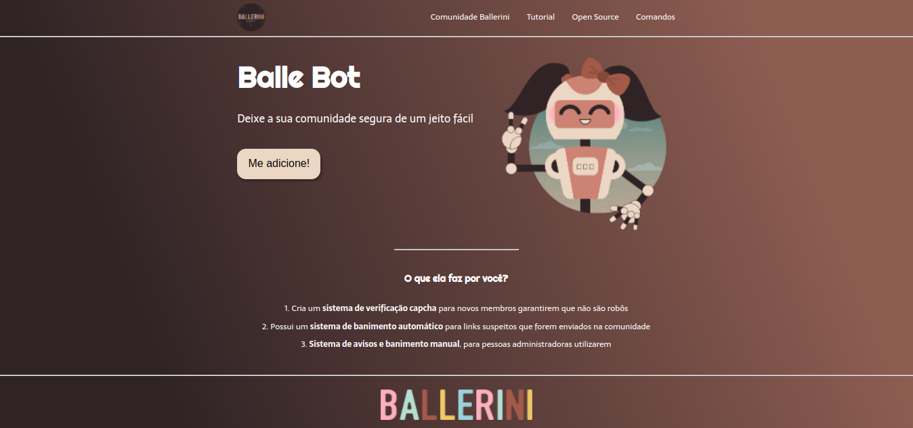

<h1> Landing Page Ballebot</h1>

Site fictício criado a partir de um figma de Rafaella Ballerine, onde o site é criado para apresentar um bot de discord.

Ela também cria este site do zero em um video,porém eu desenvolvi sozinho

Para acessar o figma <a href="https://www.figma.com/file/myqP66iQwzjwjrIAJyyrip/BalleBot?node-id=0%3A1" target="_blank"><strong>clique aqui</strong></a>

Para acessar o vídeo onde ela desenvolve o site <a href="https://www.youtube.com/watch?v=llF6vD-RljE " target="_blank"><strong>clique aqui</strong></a>

<h2> Tecnologias Usadas </h2>
<ul>
    <li>HTML5 semântico</li>
    <li>CSS3 com flexbox</li>
</ul>

Para acessar o site <a href="https://vitormancio.github.io/landing-page-ballebot/">clique aqui</a>
